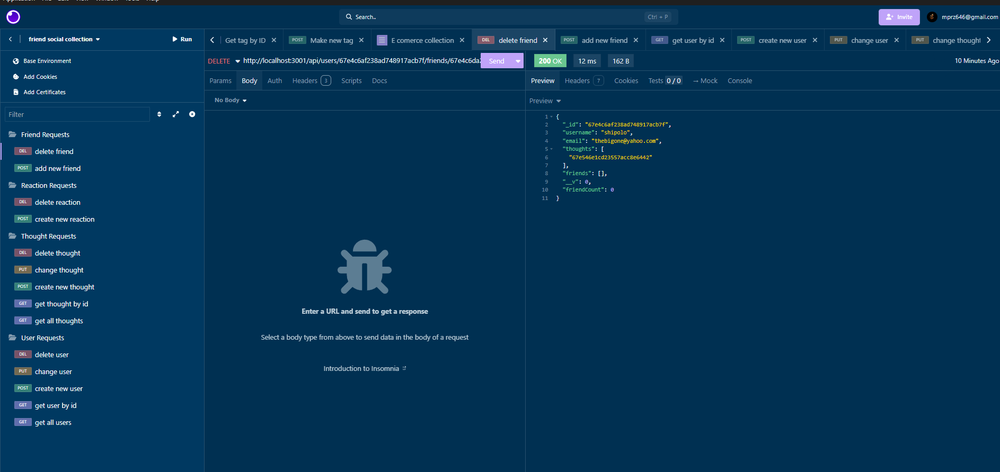

# Social Request Collection

## Table of Contents
- [Description](#description)
- [Installation](#installation)
- [Usage](#usage)
- [Questions](#questions)

## Description
this app is a a mongodb that gives request between friends, allowing them to make acounts share thoughts and react to those thoughts.

https://app.screencastify.com/v3/watch/uQBKXTxLuibnM7Q1z9pD

## Installation
by entering into the terminal of the parent folder and typing npm i and node index.js

## Usage
through the use of insomnia we can use the request features to get post change or delete the data of users, reactions, thoughts, and friend lists, simply write the right route to get the said affect.

## Questions
For any questions, you can reach me at:
- GitHub: [MIKEYP53](https://github.com/MIKEYP53)
- Email: mprz646@gmail.com
